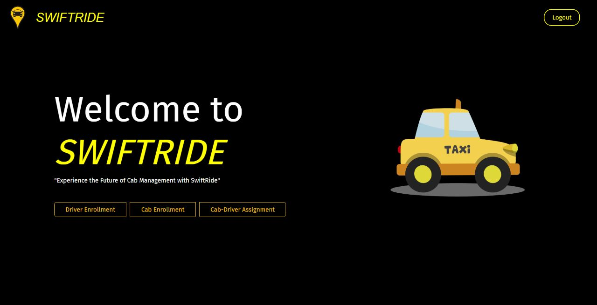
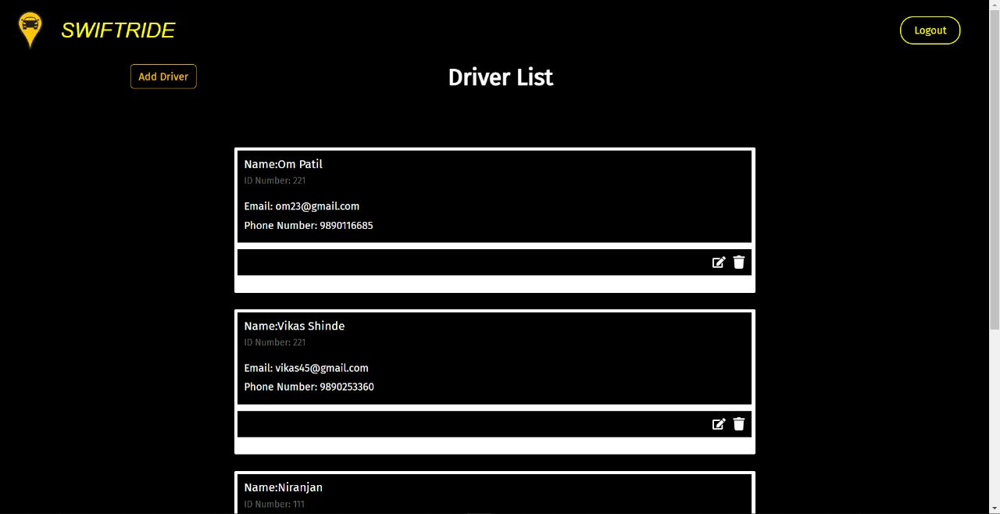
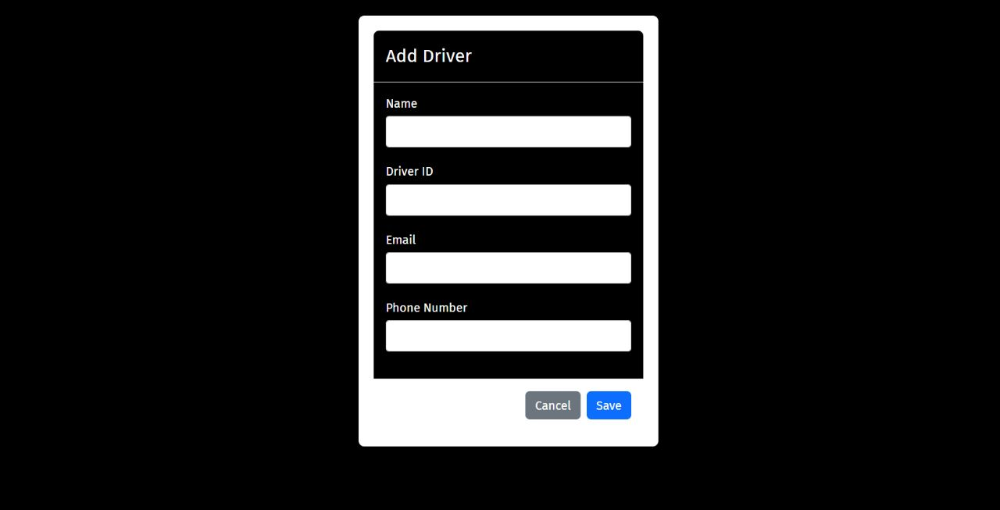
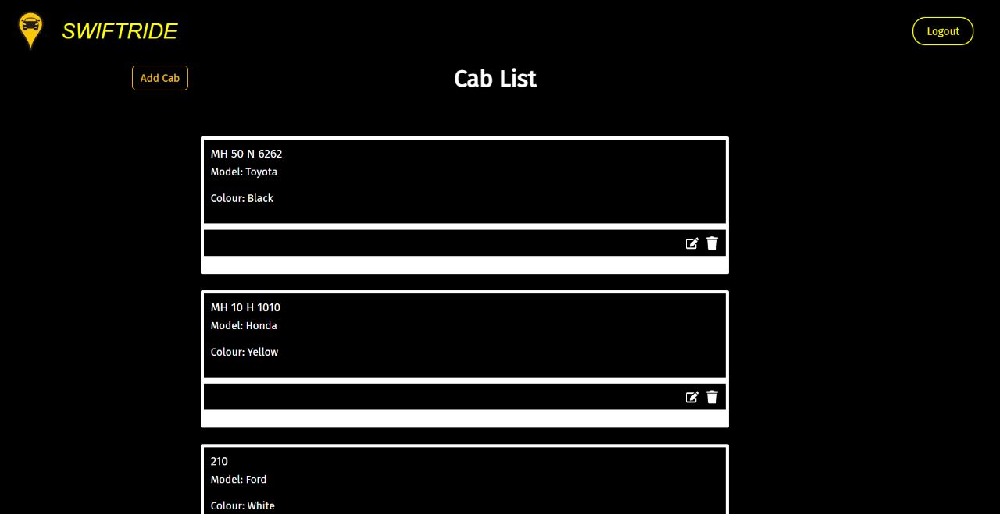
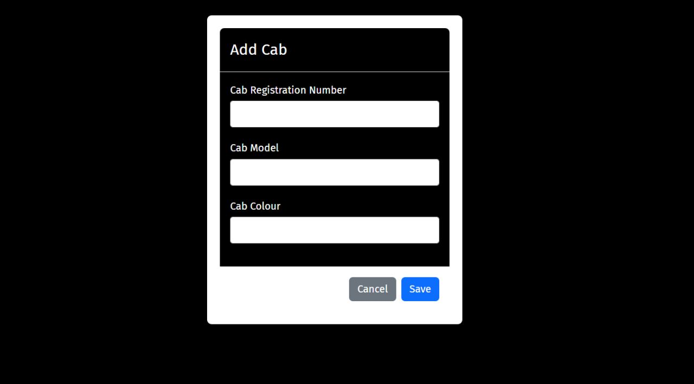
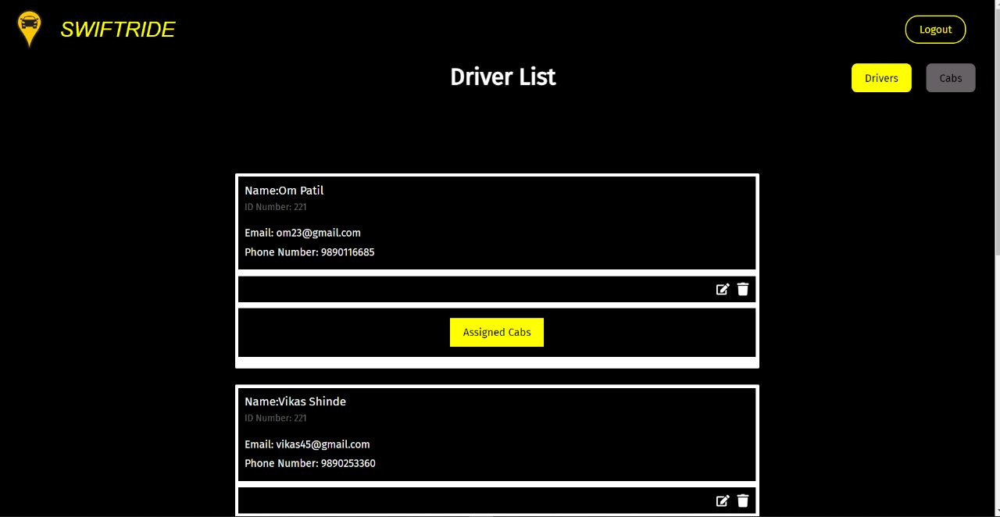
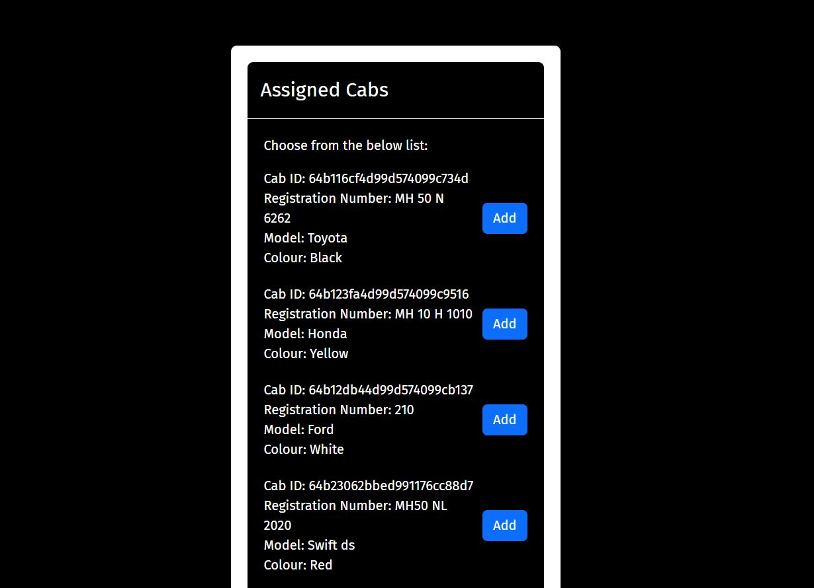
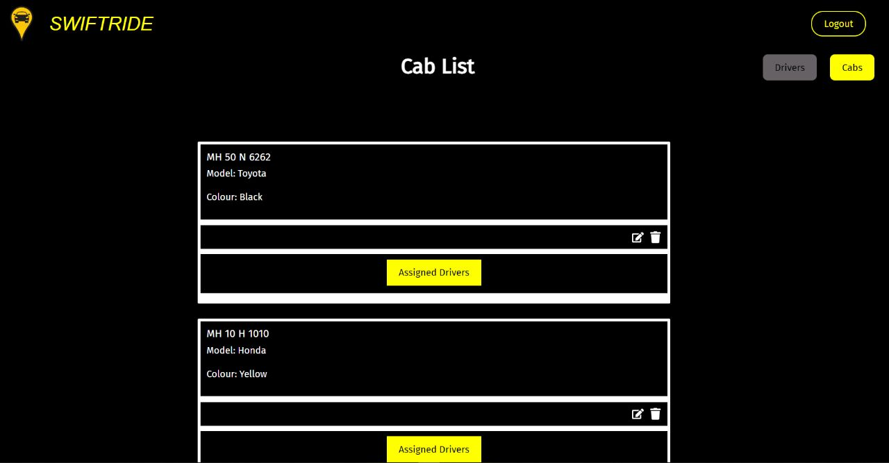
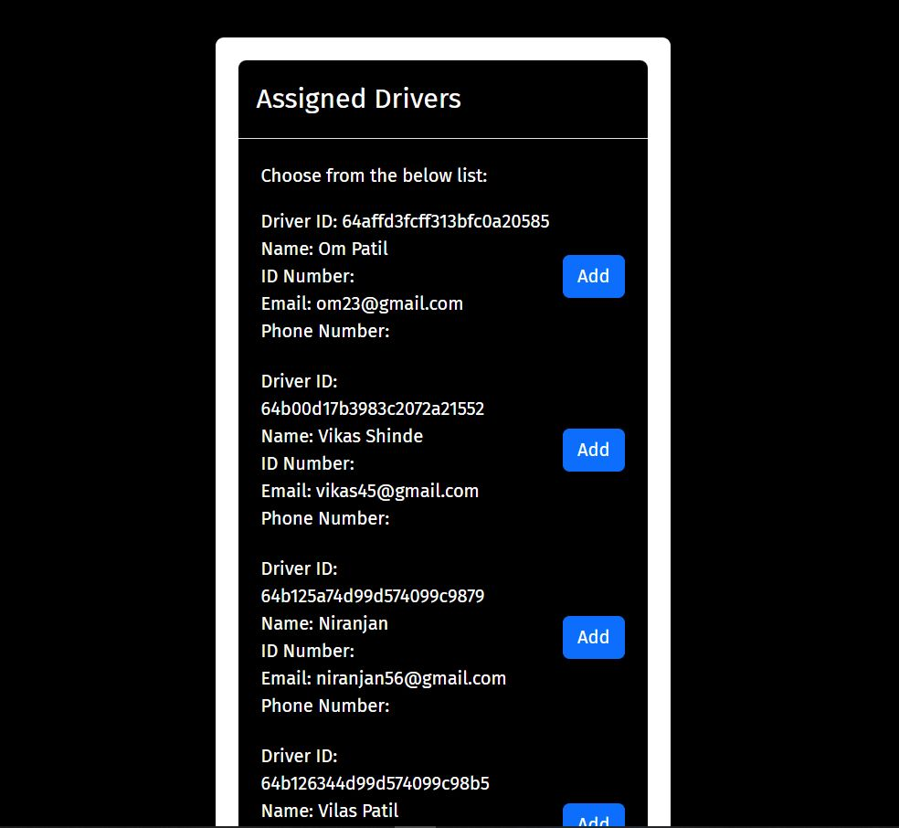

# swiftRide

# Cab Management System

- The Cab Management System is a project consisting of the problem statements aimed at building applications that can be run as containers on the cloud. The system enables creating, updating, and deleting drivers, cabs, and their assignments. In this project, users can add new drivers to the system by providing the driver's name, ID number, email, and phone number. They can also update the details of existing drivers or delete drivers from the system. Users can also edit, delete the data of the cabs details similar to the driver details. The system provides a user interface where users can navigate to the Driver Page where he can assign the cab to the driver or can navigate to the Cab page to assign the driver to the selected cab. The app also provides functionality of adding the new cab or new driver details which give user the seamless experience of the application.

---

## Home page

- On the home page, he system provides a secure login functionality for administrators. Additionally, cab enrollment to add new cabs details and driver enrollment to add the new driver details. Cab driver assignment functionality avaliable for the assigning cabs or drivers.

## Driver Enrollment

- Features of editing and deleting facility of driver details that includes contact no., name, email id etc. Admin can also delete the spcific driver if he want.

- Allows the facility to add the new driver into the database.

## Cab Enrollment

- Here, all details of cabs are to be displayed. Admin can edit,update and delete it

- Allows the facility to add the new cab into the database.

## Cab Assignment

- Displays the list of Cabs for assigning the driver to that cab

- Assigned Drivers list are to be shown and provide feature of assigning

## Driver Assignment

- Displays the list of Drivers for assigning the cab.

- Assigned cabs list are to be shown and provide feature of assigning

## Features

- Driver Details App: Allow user to add, update, delete a driver. Each driver have name, contact no, and other detils. Allow user to update the data.

- cab Details App: Allow user to add, update, delete a cab. Each cab have id, model, color and other detils. Allow user to update the data.

- Login Authtication: Includes the feature of login and signup for the adminstrtator for ease of use.

- Driver Assignment: Admin can assign the driver to the cab and also can update data of cabs fetched from cab details page.

- Cab Assignment: Admin can assign the cab to the driver and also can update data of drivers fetched from cab details page.

## Tech Stack

Frontend:- ReactJS , Material UI
Backend:- MongoDB, expressJS , NodeJS

## Future Scope

- User Feedback and Reviews: Include a feedback and review system where customers can provide ratings and reviews for drivers and their rides. This feature can help in maintaining service quality and provide valuable feedback for both drivers and the cab service provider.

- Real-time Tracking: Integrate real-time tracking functionality to provide accurate location tracking of drivers and cabs. This feature can enable customers to track their assigned cab and estimate arrival times more precisely.

- Driver and Vehicle Documentation Management: Develop a module for managing driver licenses, vehicle registration documents, insurance details, and other necessary documentation. This can help ensure compliance with legal requirements and simplify administrative tasks.

## Authentication

- Login - Registration Page
